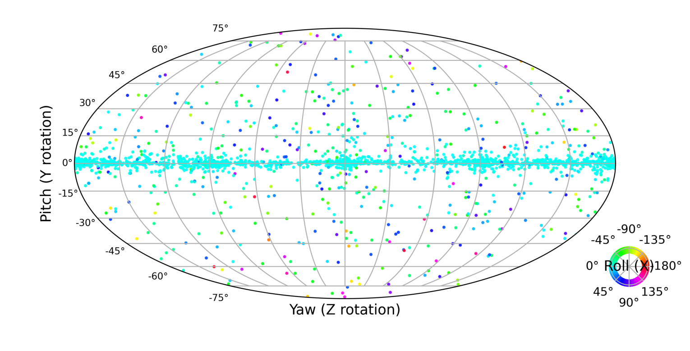
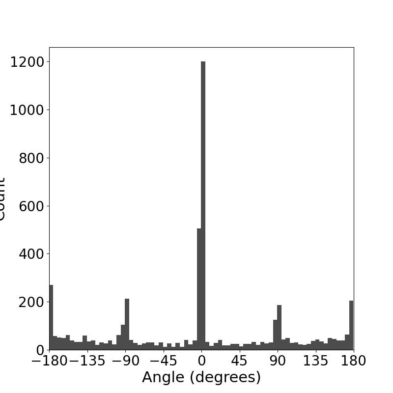
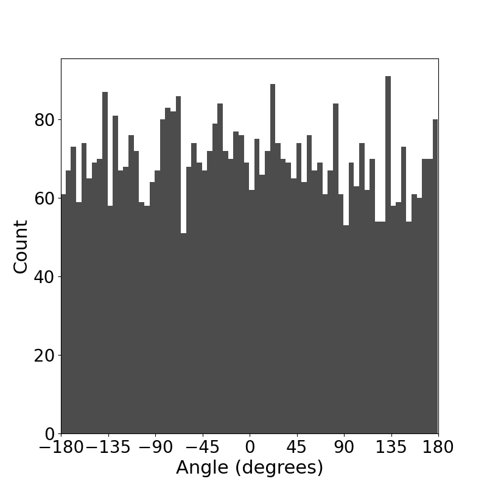
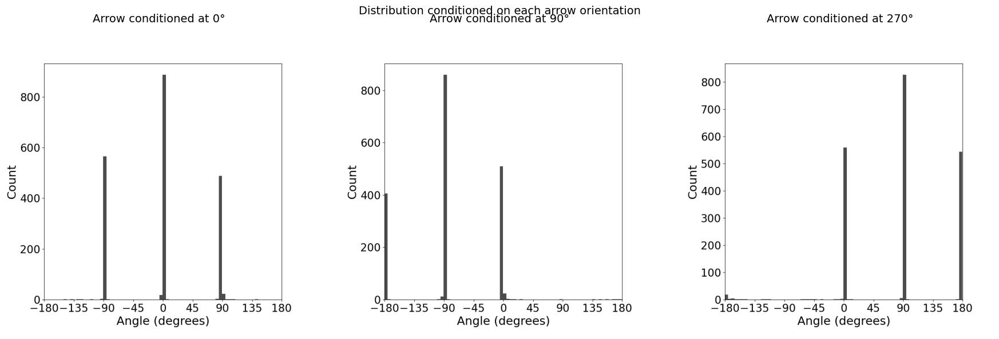
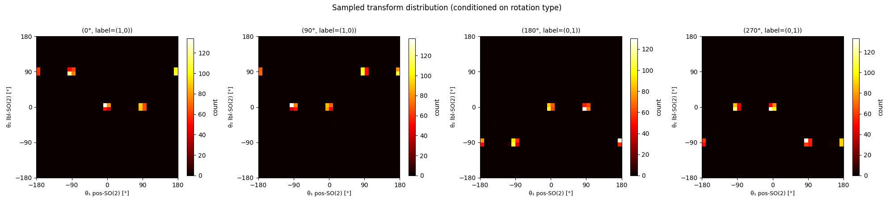
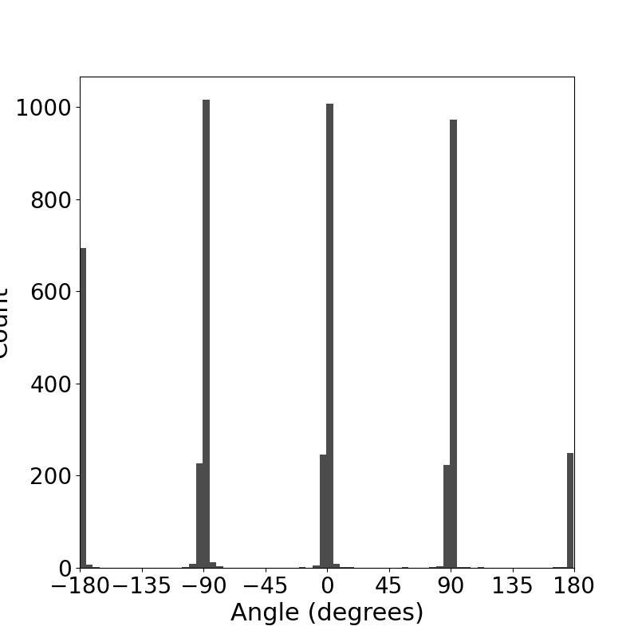

# 1. Results of MI-Motion dataset

  

  Figure 1.1: Learned distribution over SO3 group of LieFlow

  

  Figure 1.2: Histogram of z axis rotation component of LieFlow 

  

  Figure 1.3: Histogram of z axis rotation component of LieGAN

# 2. Learning Partial symmetry

## 2.1 Three arrow experiments

  

  Figure 2.1: Histogram of per-orientation visualizations on partially observed symmetries experiment

## 2.2 Labeled arrow experiment

  

  Figure 2.2: Heatmap of the discovered partial symmetry on labeled data.

# 3. C4 rectangle experiments

  

  Figure 3.1: Histogram of groups recovered from C4 rectangle dataset   

